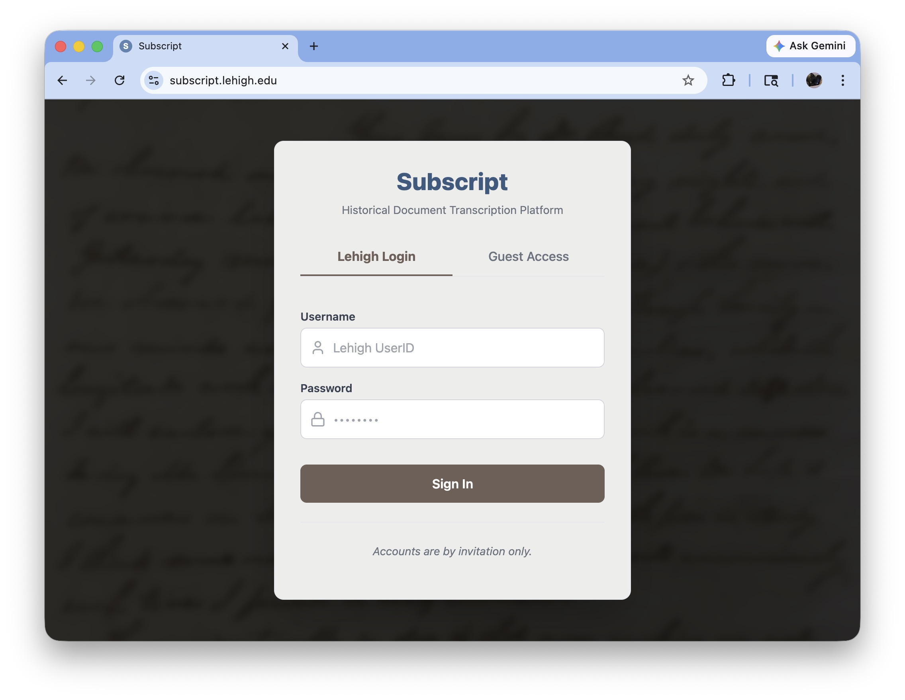
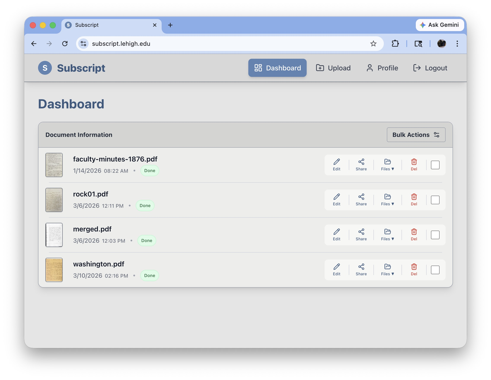
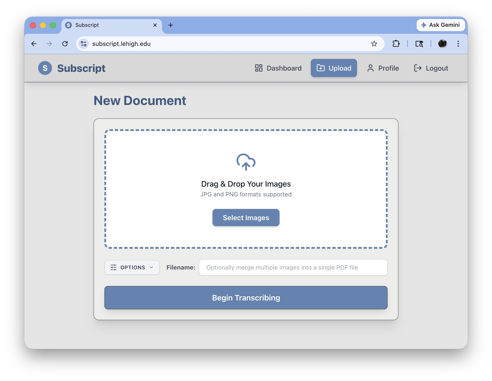
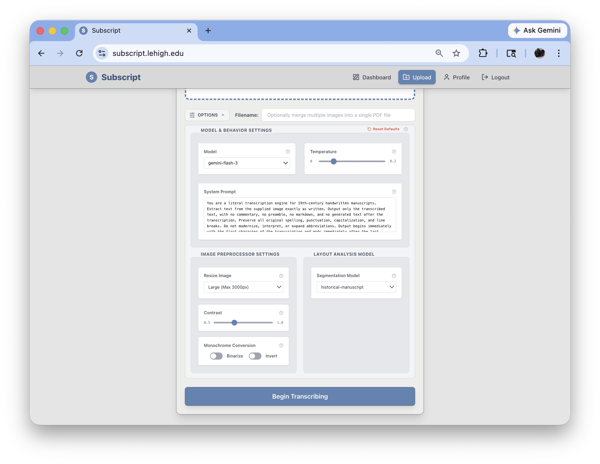
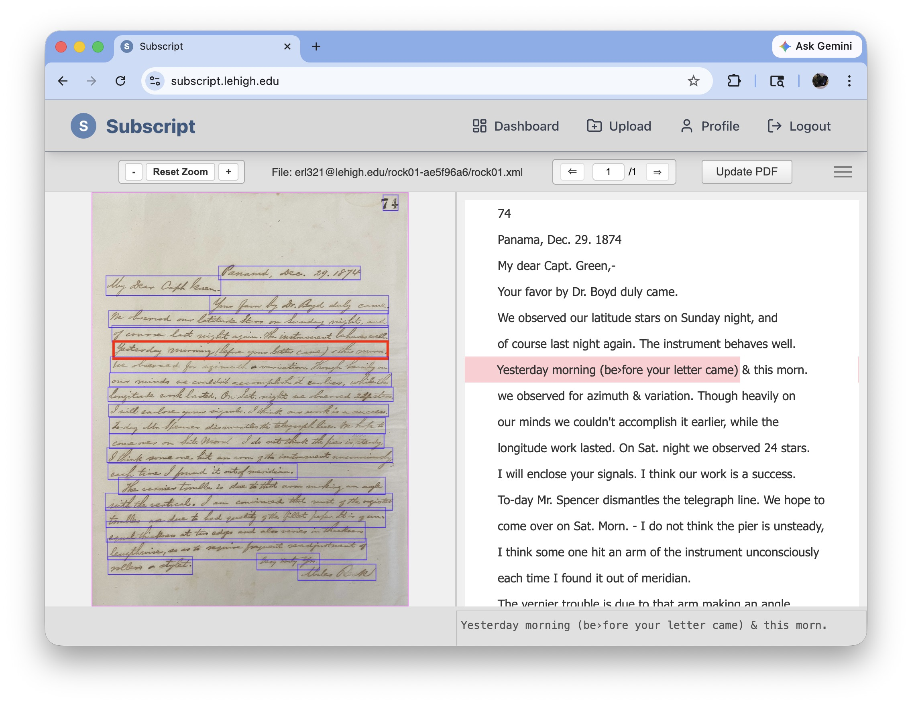
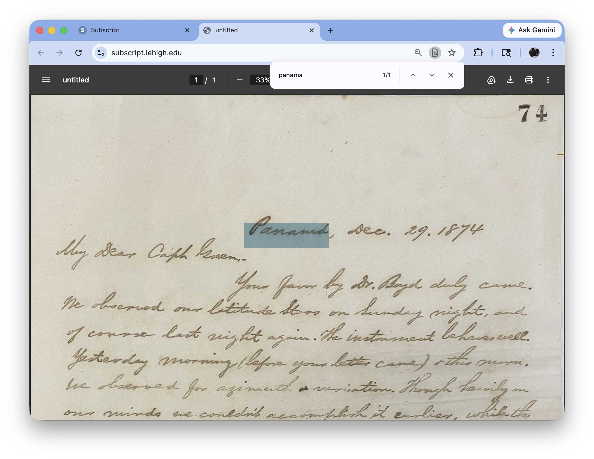

# Subscript App

A web interface for the [Subscript](https://github.com/eluhrs/subscript) handwritten text recognition (HTR) pipeline. Upload images of handwritten manuscripts, run AI-powered transcription, correct results in a built-in page editor, and export searchable PDFs — all from the browser.

## Overview

Subscript App wraps the [Subscript Python module](https://github.com/eluhrs/subscript) in a full-stack web application. The core pipeline uses **Kraken** for layout segmentation, **LLMs** (Google Gemini, OpenAI, Anthropic) for handwriting transcription, and **ReportLab** for searchable PDF generation. This application adds a web-based document management layer, an integrated PAGE XML editor for correcting transcription output, and asynchronous job processing so long-running transcriptions don't block the interface.

## Architecture

The application runs as a set of Docker containers:

| Service | Description | Port |
|---|---|---|
| **frontend** | Web UI | `8080` (configurable) |
| **backend** | FastAPI REST API | `8001` |
| **worker** | Celery task worker for async transcription jobs | — |
| **page-editor** | PHP-based PAGE XML editor ([nw-page-editor](https://github.com/mauvilsa/nw-page-editor)) | `8002` |
| **redis** | Message broker for Celery | `6379` |

Data is persisted in a SQLite database (Docker volume) and a local `documents/` directory for manuscript images and output files.

### Tech Stack

- **Backend:** Python, FastAPI, Celery, SQLite
- **Frontend:** JavaScript, CSS, HTML
- **Page Editor:** PHP (nw-page-editor)
- **HTR Engine:** [Subscript](https://github.com/eluhrs/subscript) (Kraken + LLM transcription)
- **Infrastructure:** Docker Compose, Redis
- **Authentication:** LDAP/LDAPS support, local admin accounts

## Screenshots

<!-- Add screenshots to a screenshots/ directory and update the paths below. -->

### Login Page

<a href="screenshots/login.jpg"></a>

*Login screen with LDAP and guest access tabs, set against a manuscript background.*

---

### Document Dashboard

<a href="screenshots/dashboard.jpg"></a>

*The main dashboard listing transcribed documents with thumbnail previews, status indicators, and actions for editing, sharing, and downloading files.*

---

### Document Upload

<a href="screenshots/upload.jpg"></a>

*Drag-and-drop upload interface for adding new manuscript images (JPG/PNG). Multiple images can optionally be merged into a single PDF.*

---

### Transcription Settings

<a href="screenshots/transcription-settings.jpg"></a>

*Configuration panel for tuning the transcription pipeline — select the LLM model and temperature, customize the system prompt, adjust image preprocessing (resize, contrast, binarize/invert), and choose the layout segmentation model.*

---

### PAGE XML Editor

<a href="screenshots/page-editor.jpg"></a>

*Side-by-side editor showing the original manuscript image with segmented line regions (left) and the corresponding transcription text (right). Lines can be selected and corrected individually, then saved back to update the PDF.*

---

### Searchable PDF Output

<a href="screenshots/pdf-output.jpg"></a>

*A searchable PDF generated by the pipeline. The original manuscript image is preserved while an invisible text layer enables full-text search — here, a search for "panama" highlights the match directly on the handwritten page.*

---

## Prerequisites

- **Docker** and **Docker Compose**
- **API key(s)** for at least one supported LLM provider:
  - [Google Gemini](https://ai.google.dev/)
  - [OpenAI](https://platform.openai.com/)
  - [Anthropic](https://console.anthropic.com/)

## Installation & Setup

1. **Clone the repository** (including the `subscript` submodule):

   ```bash
   git clone --recurse-submodules https://github.com/eluhrs/subscript-app.git
   cd subscript-app
   ```

   If you already cloned without `--recurse-submodules`:

   ```bash
   git submodule update --init --recursive
   ```

2. **Create your environment file:**

   ```bash
   cp example.env .env
   ```

   Then edit `.env` and fill in your values:

   ```dotenv
   # REQUIRED — generate with: python3 -c "import secrets; print(secrets.token_hex(32))"
   SECRET_KEY=your_generated_secret_key

   # At least one API key is required
   GEMINI_API_KEY=your_key_here
   OPENAI_API_KEY=your_key_here
   ANTHROPIC_API_KEY=your_key_here

   # Frontend port (default: 8080)
   APP_PORT=8080

   # LDAP authentication (optional)
   LDAP_ENABLED=true
   LDAP_SERVER_URL=ldaps://your.ldap.server:636
   LDAP_USER_DN_TEMPLATE=uid={username},dc=example,dc=com
   ```

3. **Initialize the database file** (Docker requires it to exist before mounting):

   ```bash
   touch subscript.db
   ```

4. **Create the documents directory:**

   ```bash
   mkdir documents
   ```

5. **Build and start the application:**

   ```bash
   docker compose up -d --build
   ```

6. **Create a local admin account** (if not using LDAP):

   ```bash
   ./create_local_admin.sh
   ```

## Usage

Once running, the application is available at:

| URL | Description |
|---|---|
| `http://localhost:8080` | Web interface |
| `http://localhost:8001/docs` | API documentation (Swagger UI) |
| `http://localhost:8002` | PAGE XML editor (also accessible from within the web UI) |

### Typical Workflow

1. **Upload** manuscript images through the web interface.
2. **Configure** segmentation and transcription model settings.
3. **Run** the transcription pipeline — jobs are processed asynchronously by the Celery worker.
4. **Review & correct** results using the integrated PAGE XML editor.
5. **Export** searchable PDFs with the original images and a hidden text layer.

## Configuration

Model configuration is managed through YAML config files in the `config/` directory. The Subscript module supports defining multiple segmentation and transcription models with per-model settings for prompts, temperature, token costs, and provider-specific parameters. See the [Subscript documentation](https://github.com/eluhrs/subscript#configuration-configyml) for the full configuration reference.

## Related Projects

- **[Subscript](https://github.com/eluhrs/subscript)** — The command-line HTR pipeline that powers this application. Can also be used standalone for batch processing.
- **[nw-page-editor](https://github.com/mauvilsa/nw-page-editor)** — The PAGE XML editor integrated into this app.
- **[Kraken](https://kraken.re/)** — OCR/HTR engine used for layout segmentation.

## License

**GNU General Public License v3.0**

This program is free software: you can redistribute it and/or modify it under the terms of the GNU General Public License as published by the Free Software Foundation, either version 3 of the License, or (at your option) any later version. See [LICENSE](LICENSE) for details.
